# DIU24
Prácticas Diseño Interfaces de Usuario 2023-24 (Tema: Club de Juegos de Mesa) 

Grupo: DIU1.OlivasAndaluzas  Curso: 2023/24 
Updated: 3/6/2024

Proyecto: 
Mundo del Tablero

Descripción: 

>> Hemos desarrollado una aplicación móvil llamada Mundo del Tablero, dedicada a los juegos de mesa. Con esta app, los usuarios pueden participar en diversos torneos y adquirir una amplia variedad de juegos de mesa.

Logotipo: 

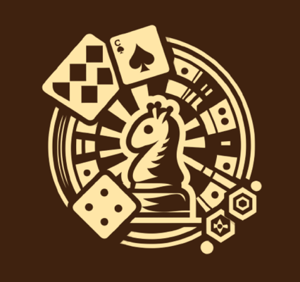

Miembros
 * :bust_in_silhouette:   Ana Isabel Mena Meseguer     :octocat:     
 * :bust_in_silhouette:  José Luis Parra Azor     :octocat:

----- 

>>> Este documento es el esqueleto del report final de la práctica. Aparte de subir cada entrega a PRADO, se debe actualizar y dar formato de informe final a este documento online. Elimine este texto desde la práctica 1

# Proceso de Diseño 

## Paso 1. UX User & Desk Research & Analisis 

 **1.a User Reseach Plan**
-----

>>> Nos centramos en la creación de una página web dedicada a los torneos de juegos de mesa. Nuestro propósito es aumentar la visibilidad en Granada y convertirnos en un referente regional en Andalucía. Para ello tenemos como objetivo hacer crecer los ingresos y clientes, además de fidelizar a los clientes que ya tenemos. Se utilizarán métodos de investigación primaria, como análisis de competidores, mapas de viaje y revisiones de usabilidad. Los temas de investigación incluyen la experiencia previa con el teatro, intereses y motivaciones, y preferencias de contenido. Aunque no tenemos experiencia directa con los torneos de juegos de mesa, hemos creado dos perfiles ficticios de personas para guiarnos mejor en esta investigación.  

 1.b Competitive Analysis
-----

>>> Algunas caracteristicas que hemos tenido en cuenta para comparar han sido:
>>>  * Interactividad de la pagina, entendiendo esto como lo interactiva que es la página para el usuario.
>>>  * Inscripción, es decir, la facilidad del usuario para poder acceder e inscribirse a los cursos que ofrecen.
>>>  * Soporte de usuario. Para valorar esto hemos tenido en cuenta la facilidad del usuario para acceder a redes sociales o para contactar con la escuela a traves del telefono o el correo
>>>  * Personalización de la experiencia, que significa la capacidad de crearte un perfil para tener un acceso mas personal a la página.  

 1.c Persona
-----

>>> Para está práctica hemos elegido estas dos personas con el fin de intentar abarcar distintas edades, culturas,  ocupaciones y razones por las que apuntarse al teatro, pero a la vez no ampliar mucho las necesidades para poder centrarnos en ambos y que siga siendo funcional. Las dos personas que hemos creado tienen realmente el mismo objetivo, pasar un buen rato con gente con gustos similares, solo que Jimena lo hace para mejorar en el ámbito laboral y Giuseppe busca más conocer amigos que pueda mantener y ocupar el tiempo libre.

 1.d User Journey Map
----

>>> Hemos elegido estos dos casos de estudio porque creemos que es el mayor punto débil de la página web, ya que al final el propósito es vender, y lo que más se nos dificulta a la hora de usarla es el momento de inscribirse en una actividad. En primer lugar no queda claro como se puede inscribir uno en una actividad, y por otro lado el formulario no es del todo claro porque no se entiende para qué casos se puede usar y como y cuando se va a recibir respuesta.

 1.e Usability Review
----

>>> - Enlace al documento: [Usability_Review](P1/5.Usability_Review/Usability-review.pdf)
>>> - Valoración final (numérica): 56 - Moderate
>>> - Comentario sobre la valoración: Estamos de acuerdo con esta valoración ya que aunque haya algunas partes que mejoramos, generalmente son elementos estéticos y visuales. La página como tal no tiene un gran número de errores ni le faltan muchos elementos. Lo que más hemos echado en falta era un poco más de personalización de la experiencia, ya sea con un inicio de sesión más general, y no solo en la tienda o con elementos de búsqueda en la página para poder acceder más fácilmente a lo que el usuario busca

## Paso 2. UX Design  

 2.a Reframing / IDEACION: Feedback Capture Grid / EMpathy map 
----

>>> Comenta con un diagrama los aspectos más destacados a modo de conclusion de la práctica anterior,

  
    
>>> ¿Que planteas como "propuesta de valor" para un nuevo diseño de aplicación para economia colaborativa ?
>>> Problema e hipótesis
>>>  Que planteas como "propuesta de valor" para un nuevo diseño de aplicación para economia colaborativa te
>>> (150-200 caracteres)

 2.b ScopeCanvas
----

>>> Para nuestro proyecto, hemos pensado un club de juegos de mesa donde las personas se puedan sentir agusto en un ambiente cercano, conociendo gente con gustos parecidos con los que compartir esta afición por los juegos de mesa. Ademas, nuestro objetivo es hacernos conocer en toda España como uno de los clubs de juegos de mesa más famosos, ofreciendo tanto torneos dentro del club como fuera del mismo con otros clubs de juegos de mesa y una tienda en la que podamos ofrecer nuestros productos . Junto a los productos y servicios, queremos ofrecer una sección de comentarios y valoraciones tanto de unos como de otros para mostrar las opiniones de los clientes acerca de nuestro club.

 2.b User Flow (task) analysis 
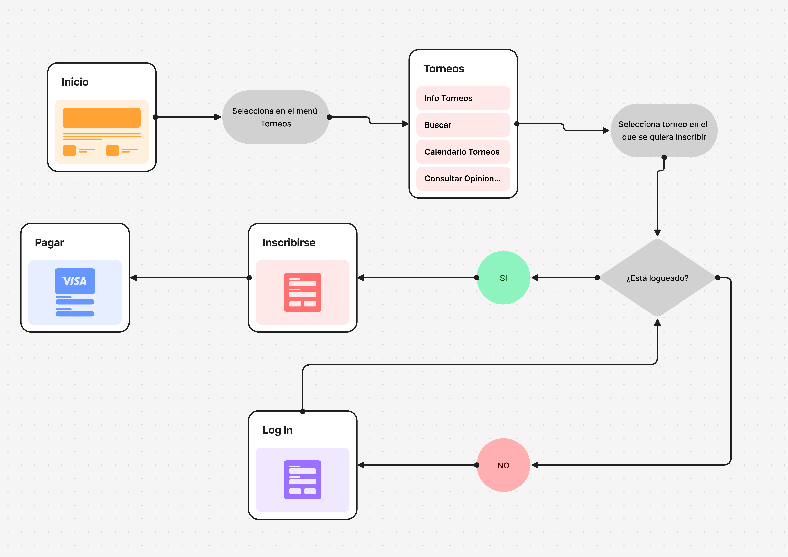
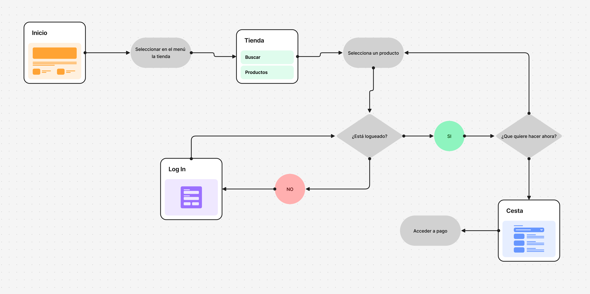
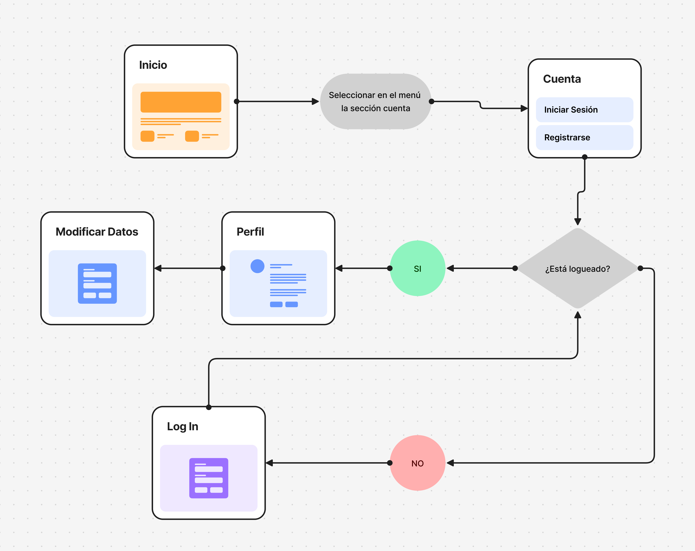
-----
|Tareas | Jovenes Granadinos|Gente de fuera de granada|Adultos mayores (+60)|Amantes de los juegos|
|:----|:----|:----|:----|:----|
|Encontrar la ubicación del club|L|H|M|M|
|Acceder a un calendario de torneos|H|L|M|H|
|Acceder a la tienda de juegos de mesa|H|L|L|H|
|Comprar productos de la tienda|H|M|L|H|
|Acceder a un menú con todos los servicios que ofrece el club|M|H|L|M|
|Inscribirse en torneos de forma fácil e intuitiva|M|L|M|H|
|Contar su experiencia en los diferentes torneos|M|L|L|H|
|Visualizar videos sobre las actividades que se realizan en el club|M|H|L|M|
>>> Definir "User Map" y "Task Flow" ... 

 2.c IA: Sitemap + Labelling 
----

|Label|Scope Note|
|:----|:----|
|Inicio|Página principal con acceso a las funcionalidades más importantes del sitio. |
|Torneos|Página donde se muestra lo relacionado con los torneos.|
|Inscribirse|Al seleccionar un torneo, página donde inscribirse en él.|
|Pagar inscripción|Al inscribirse en un torneo, página de pago de la inscripción.|
|Calendario Torneos|Sección de la página torneos para mostrar un calendario con los torneos disponibles.|
|Consultar opiniones|Sección de la página torneos con opiniones sobre nuestros torneos.|
|Buscar|Buscar torneos a través de filtros (por categorías, fechas, precio).|
|Info Torneos|Sección de la página torneos donde visualizamos la información de cada torneo.|
|Tienda|Página donde visualizar los productos que se venden.|
|Cesta|Al seleccionar todos los productos que quieres, página donde visualizar tu lista de compra.|
|Productos|Sección de la página tienda donde visualizar los productos.|
|Buscar|Buscar productos según distintos filtros (categoría, precio).|
|Cuenta|Página donde poder registrarse o iniciar sesión en nuestra página.|
|Iniciar Sesión|Poder iniciar sesión si ya tienes una cuenta.|
|Registrarse|Poder registrarse si no tienes una cuenta.|
|Mis comentarios|Página donde poder visualizar todos los comentarios que has realizado en la página.|
|Mis torneos|Página donde poder visualizar todos los torneos en los que has participado, con tu ranking.|
|Perfil|Página donde poder visualizar los datos acerca de nuestro usuario (nombre, correo, contraseña, número de teléfono).|
|Modificar datos|Página donde modificar los datos actuales así como añadir algún campo opcional que no estuviese completado.|
|Cerrar sesión|Poder cerrar sesión de tu cuenta.|
|Sobre Nosotros|Página donde encontrar toda la información sobre nuestro club, además de una breve descripción.|
|Preguntas frecuentes|Sección de la página Sobre Nosotros donde poder encontrar algunas preguntas frecuentes que hacen los usuarios con sus respectivas respuestas.|
|Donde nos encontramos|Sección de la página Sobre Nosotros  donde encontrar la dirección del club, además de un mapa para poder visualizarlo más claramente.|
|Contacto|Sección de la página Sobre Nosotros  donde encontrar los diferentes contactos, como el teléfono o las redes sociales.|
|Valoraciones|Sección de la página Sobre Nosotros  donde encontrar las valoraciones sobre nuestro club, y poder valorarla.|

 2.d Wireframes
-----

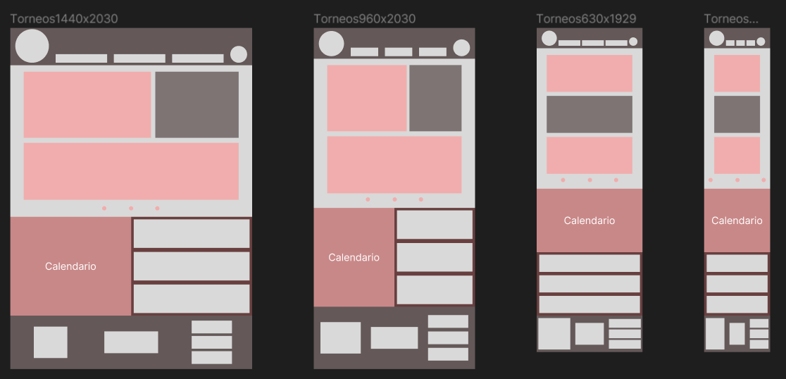
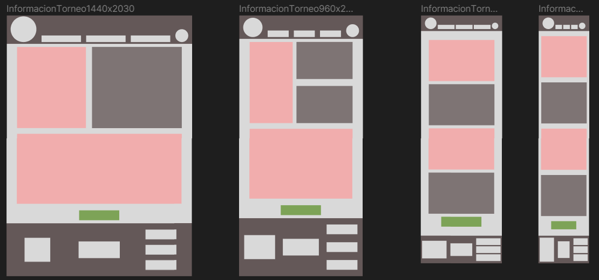

## Paso 3. Mi UX-Case Study (diseño)

 3.a Moodboard
-----
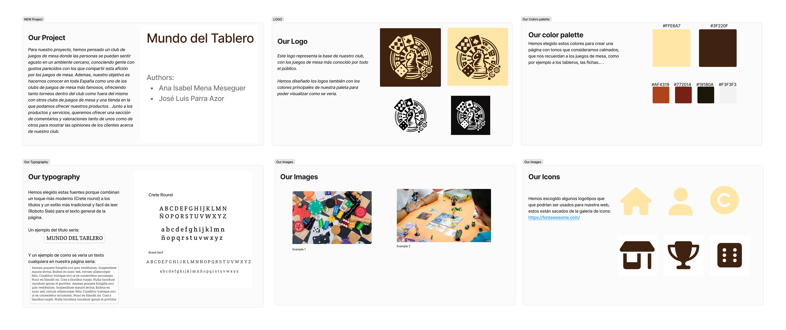

>>> Plantear Diseño visual con una guía de estilos visual (moodboard) 
>>> Incluir Logotipo
>>> Si diseña un logotipo, explique la herramienta utilizada y la resolución empleada. ¿Puede usar esta imagen como cabecera de Twitter, por ejemplo, o necesita otra?

  3.b Landing Page
----
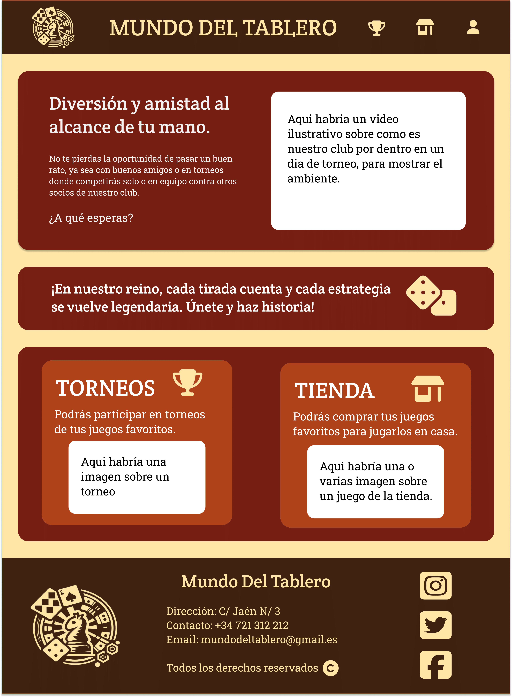

 3.c Guidelines
----

  3.d Mockup
----

[Nuestro Proyecto](https://www.figma.com/proto/zP4HDfFXl0xrYYd9M8lS0L/Aplicaci%C3%B3n-Mundo-del-Tablero?node-id=2-93&t=QAEkqCbW5d8wMAdw-1&scaling=scale-down&page-id=0%3A1&starting-point-node-id=2%3A2)

 3.e ¿My UX-Case Study?
-----

>>> Publicar my Case Study en Github..
>>> Documente y resuma el diseño de su producto

## Paso 5. Exportación & evaluación con Eye Tracking 

Exportación a HTML/Flutter
-----

)  5.b Eye Tracking method
-----

>>> Para la realización de este experimento le hemos mostrado diferentes imágenes de las 2 apps a una amiga, la cual ha ido mirando a lo que más le llamaba la atención de la página.

Diseño del experimento 
----

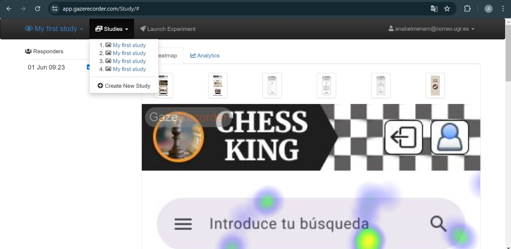  

Resultados y valoración 
-----

>> Torneos: En este caso, el punto de interés ha sido la parte de torneo actual de la sección de torneos, donde el color de fondo junto a la imagen han llamado la atención del usuario.

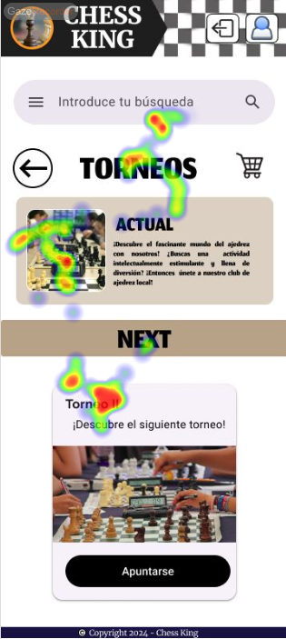

>> General y Tienda: En este caso, el punto de interés marcado por el usuario es en la tienda, ya que cada artículo se muestra de forma muy visual.

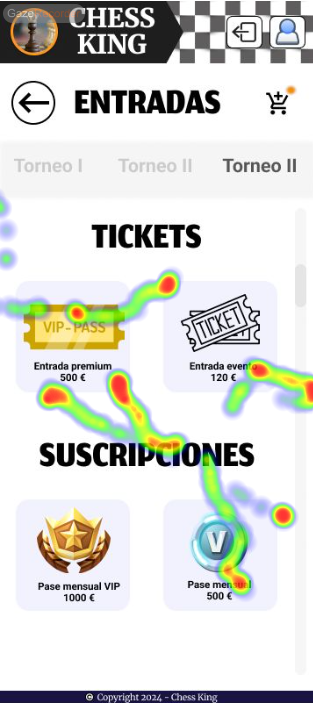  

## Paso 4. Evaluación 

 4.a Caso asignado
----

>>>Esta app consiste en un club VIP de torneos de juegos de mesa. Además, también podemos consultar el ranking actual de ganadores, una tienda online de productos, una sección para visualizar las instalaciones y otra sección sobre información acerca del club. [Link a su GitHub](https://github.com/jseg380/DIU)

 4.b User Testing
----

| ID    | Sexo/Edad        | Ocupación    | Experiencia Internet | Plataforma        | Perfil Cubierto               | TEST | SUS Score |
|-------|-------------------|--------------|----------------------|-------------------|-------------------------------|------|-----------|
| José  | Hombre, 68 años   | Jubilado     | Baja                 | Teléfono          | Anciano / bailar / felicidad  | B    | 55        |
| Paqui | Mujer, 50 años    | Administrativa | Media               | Windows / Teléfono | Minusválida / fotografía / miedo | B    | 67.5      |
| Pablo | Hombre, 18 años   | Estudiante   | Alta                 | Windows / Teléfono | Familiar / estudioso / enfado | A    | 77.5      |
| Laura | Mujer, 35 años    | Limpiadora   | Media                | Teléfono          | Tranquila / idiomas / triste  | A    | 72.5      |

 4.c Cuestionario SUS
----

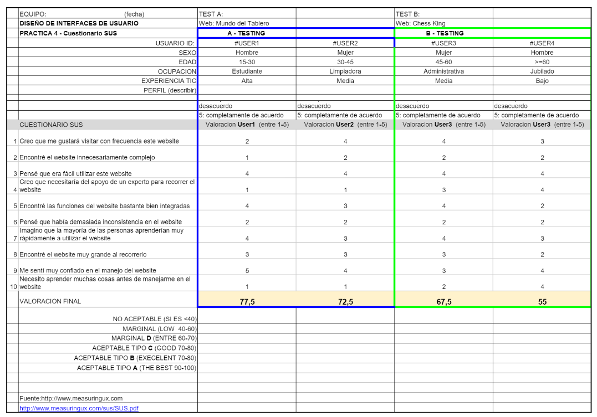 

>> Dado que los usuarios que evaluan esta app son personas de una edad >=50, con un poca experiencia en tecnología, los resultados muestran que a pesar de ser una app muy completa, puede resultar complicada de utilizar ya que faltan algunas guías de uso, como podría ser poner flechas en las secciones que se puedan desplazar, o poner una sección de tienda que esté a la vista desde la página principal. 

>> La puntuación media que sale como resultado del cuestionario SUS es de 61,25, que corresponde casi a una C. Esto significa que la usabilidad de la página es correcta pero debería haber ciertas mejoras, sobre todo enfocadas a las personas con menos experiencia en tecnología. 
 

 4.d Usability Report
----
[Usability Report](P4/4.UsabilityReport/UsabilityReport.pdf)

5.) Conclusion de EVALUACION (A/B testing + usability report + eye tracking) 
----

>> En general, la app Chess King presenta una funcionalidad robusta y una oferta completa para los amantes de los juegos de mesa. Sin embargo, la usabilidad actual de la aplicación puede ser desafiante, especialmente para los usuarios mayores o con menos experiencia en tecnología. Los resultados del cuestionario SUS, con una puntuación media de 61.25, sugieren que aunque la app es funcional, necesita mejoras significativas en términos de accesibilidad y facilidad de uso.

>> El análisis de eye tracking muestra que ciertas áreas, como la sección de torneos y la tienda, captan la atención de los usuarios, pero la navegación y la claridad en otras secciones requieren refinamiento. Los usuarios reportaron dificultades para encontrar y utilizar algunas funciones clave debido a la falta de indicaciones visuales y elementos interactivos claros.

## Conclusión final / Valoración de las prácticas

>>> (90-150 palabras) Opinión FINAL del proceso de desarrollo de diseño siguiendo metodología UX y valoración (positiva /negativa) de los resultados obtenidos  

