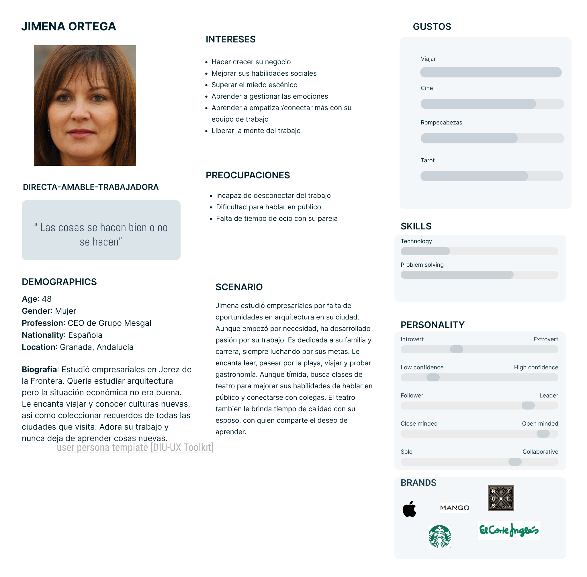
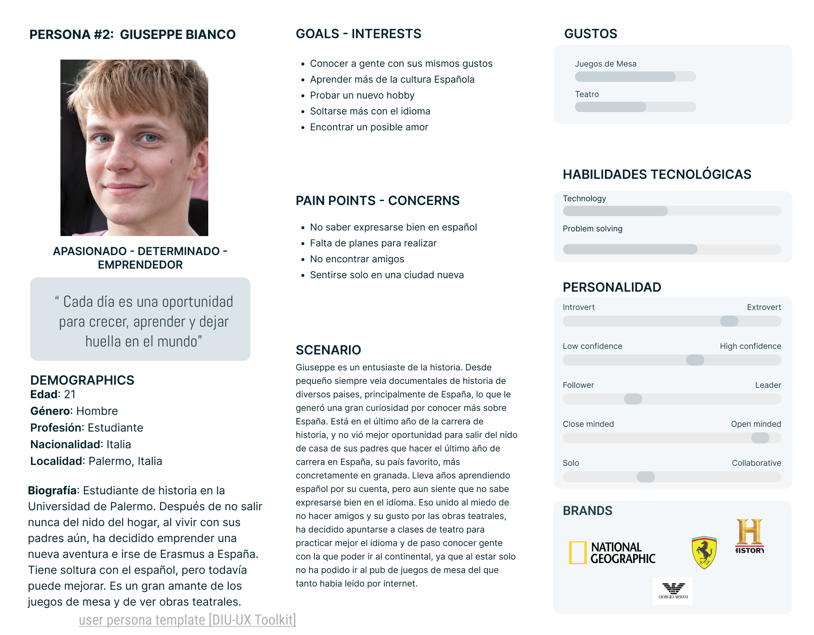

# DIU24
Prácticas Diseño Interfaces de Usuario 2023-24 (Tema: Teatro Escénico) 

Grupo: DIU1.OlivasAndaluzas  Curso: 2023/24 
Updated: 10/3/2024

Proyecto: 
>>> Decida el nombre corto de su propuesta en la práctica 2 

Descripción: 

>>> Describa la idea de su producto en la práctica 2 

Logotipo: 
>>> Opcionalmente si diseña un logotipo para su producto en la práctica 3 pongalo aqui

Miembros
 * :bust_in_silhouette:   Ana Isabel Mena Meseguer     :octocat:     
 * :bust_in_silhouette:  José Luis Parra Azor     :octocat:

----- 

>>> Este documento es el esqueleto del report final de la práctica. Aparte de subir cada entrega a PRADO, se debe actualizar y dar formato de informe final a este documento online. Elimine este texto desde la práctica 1

# Proceso de Diseño 

## Paso 1. UX User & Desk Research & Analisis 

 **1.a User Reseach Plan**
-----

>>> Nos centramos en la creación de una página web dedicada al teatro amateur. Nuestro propósito es aumentar la visibilidad en Granada y convertirnos en un referente regional en Andalucía. Para ello tenemos como objetivo hacer crecer los ingresos y clientes, además de fidelizar a los clientes que ya tenemos. Se utilizarán métodos de investigación primaria, como análisis de competidores, mapas de viaje y revisiones de usabilidad. Los temas de investigación incluyen la experiencia previa con el teatro, intereses y motivaciones, y preferencias de contenido. Aunque no tenemos experiencia directa con el teatro, hemos creado dos perfiles ficticios de personas para guiarnos mejor en esta investigación.  

 1.b Competitive Analysis
-----

>>> Algunas caracteristicas que hemos tenido en cuenta para comparar han sido:
>>>  * Interactividad de la pagina, entendiendo esto como lo interactiva que es la página para el usuario.
>>>  * Inscripción, es decir, la facilidad del usuario para poder acceder e inscribirse a los cursos que ofrecen.
>>>  * Soporte de usuario. Para valorar esto hemos tenido en cuenta la facilidad del usuario para acceder a redes sociales o para contactar con la escuela a traves del telefono o el correo
>>>  * Personalización de la experiencia, que significa la capacidad de crearte un perfil para tener un acceso mas personal a la página.  

 1.c Persona
-----

>>> Para está práctica hemos elegido estas dos personas con el fin de intentar abarcar distintas edades, culturas,  ocupaciones y razones por las que apuntarse al teatro, pero a la vez no ampliar mucho las necesidades para poder centrarnos en ambos y que siga siendo funcional. Las dos personas que hemos creado tienen realmente el mismo objetivo, pasar un buen rato con gente con gustos similares, solo que Jimena lo hace para mejorar en el ámbito laboral y Giuseppe busca más conocer amigos que pueda mantener y ocupar el tiempo libre.

 1.d User Journey Map
----

>>> Hemos elegido estos dos casos de estudio porque creemos que es el mayor punto débil de la página web, ya que al final el propósito es vender, y lo que más se nos dificulta a la hora de usarla es el momento de inscribirse en una actividad. En primer lugar no queda claro como se puede inscribir uno en una actividad, y por otro lado el formulario no es del todo claro porque no se entiende para qué casos se puede usar y como y cuando se va a recibir respuesta.

 1.e Usability Review
----

>>> - Enlace al documento: [Usability_Review](P1/5.Usability_Review/Usability-review.pdf)
>>> - Valoración final (numérica): 56 - Moderate
>>> - Comentario sobre la valoración: Estamos de acuerdo con esta valoración ya que aunque haya algunas partes que mejoramos, generalmente son elementos estéticos y visuales. La página como tal no tiene un gran número de errores ni le faltan muchos elementos. Lo que más hemos echado en falta era un poco más de personalización de la experiencia, ya sea con un inicio de sesión más general, y no solo en la tienda o con elementos de búsqueda en la página para poder acceder más fácilmente a lo que el usuario busca

## Paso 2. UX Design  

 2.a Reframing / IDEACION: Feedback Capture Grid / EMpathy map 
----

>>> Comenta con un diagrama los aspectos más destacados a modo de conclusion de la práctica anterior,

  
    
>>> ¿Que planteas como "propuesta de valor" para un nuevo diseño de aplicación para economia colaborativa ?
>>> Problema e hipótesis
>>>  Que planteas como "propuesta de valor" para un nuevo diseño de aplicación para economia colaborativa te
>>> (150-200 caracteres)

 2.b ScopeCanvas
----

>>> Para nuestro proyecto, hemos pensado un club de juegos de mesa donde las personas se puedan sentir agusto en un ambiente cercano, conociendo gente con gustos parecidos con los que compartir esta afición por los juegos de mesa. Ademas, nuestro objetivo es hacernos conocer en toda España como uno de los clubs de juegos de mesa más famosos, ofreciendo tanto torneos dentro del club como fuera del mismo con otros clubs de juegos de mesa y una tienda en la que podamos ofrecer nuestros productos a la vez que los socios puedan comprarlos o vender sus propios productos. Junto a los productos y servicios, queremos ofrecer una sección de comentarios y valoraciones tanto de unos como de otros para mostrar las opiniones de los clientes acerca de nuestro club.

 2.b User Flow (task) analysis 
-----

>>> Definir "User Map" y "Task Flow" ... 

 2.c IA: Sitemap + Labelling 
----

>>> Identificar términos para diálogo con usuario  

Término | Significado     
| ------------- | -------
  Login¿?  | acceder a plataforma

 2.d Wireframes
-----

>>> Plantear el  diseño del layout para Web/movil (organización y simulación ) 

## Paso 3. Mi UX-Case Study (diseño)

 3.a Moodboard
-----

>>> Plantear Diseño visual con una guía de estilos visual (moodboard) 
>>> Incluir Logotipo
>>> Si diseña un logotipo, explique la herramienta utilizada y la resolución empleada. ¿Puede usar esta imagen como cabecera de Twitter, por ejemplo, o necesita otra?

  3.b Landing Page
----

>>> Plantear Landing Page 

 3.c Guidelines
----

>>> Estudio de Guidelines y Patrones IU a usar 
>>> Tras documentarse, muestre las deciones tomadas sobre Patrones IU a usar para la fase siguiente de prototipado. 

  3.d Mockup
----

>>> Layout: Mockup / prototipo HTML  (que permita simular tareas con estilo de IU seleccionado)

 3.e ¿My UX-Case Study?
-----

>>> Publicar my Case Study en Github..
>>> Documente y resuma el diseño de su producto

## Paso 5. Exportación & evaluación con Eye Tracking 

Exportación a HTML/Flutter
-----

)  5.b Eye Tracking method 

>>> Indica cómo diseñas experimento y reclutas usuarios (uso de gazerecorder.com)  

Diseño del experimento 
----

>> Uso de imágenes (preferentemente) -> hay que esablecer una duración de visualización y  
>> fijar las áreas de interes (AoI) antes del diseño. Planificar qué tarea debe hacer el usuario (buscar, comprar...) 

  
>> cambiar img por tu diseño de experimento  

>> Recordar que gazerecorder es una versión de pruebas: usar sólo con 3 usuarios para generar mapa de calor (recordar que crédito > 0 para que funcione) 

Resultados y valoración 
-----

>> Cambiar por tus resultados
  

## Paso 4. Evaluación 

 4.a Caso asignado
----

>>> Breve descripción del caso asignado con enlace a  su repositorio Github

 4.b User Testing
----

>>> Seleccione 4 personas ficticias. Exprese las ideas de posibles situaciones conflictivas de esa persona en las propuestas evaluadas. Asigne dos a Caso A y 2 al caso B
 

| Usuarios | Sexo/Edad     | Ocupación   |  Exp.TIC    | Personalidad | Plataforma | TestA/B
| ------------- | -------- | ----------- | ----------- | -----------  | ---------- | ----
| User1's name  | H / 18   | Estudiante  | Media       | Introvertido | Web.       | A 
| User2's name  | H / 18   | Estudiante  | Media       | Timido       | Web        | A 
| User3's name  | M / 35   | Abogado     | Baja        | Emocional    | móvil      | B 
| User4's name  | H / 18   | Estudiante  | Media       | Racional     | Web        | B 

 4.c Cuestionario SUS
----

>>> Usaremos el **Cuestionario SUS** para valorar la satisfacción de cada usuario con el diseño (A/B) realizado. Para ello usamos la [hoja de cálculo](https://github.com/mgea/DIU19/blob/master/Cuestionario%20SUS%20DIU.xlsx) para calcular resultados sigiendo las pautas para usar la escala SUS e interpretar los resultados
http://usabilitygeek.com/how-to-use-the-system-usability-scale-sus-to-evaluate-the-usability-of-your-website/)
Para más información, consultar aquí sobre la [metodología SUS](https://cui.unige.ch/isi/icle-wiki/_media/ipm:test-suschapt.pdf)

>>> Adjuntar captura de imagen con los resultados + Valoración personal 

 4.d Usability Report
----

>> Añadir report de usabilidad para práctica B (la de los compañeros)

>>> Valoración personal 

5.) Conclusion de EVALUACION (A/B testing + usability report + eye tracking) 
----

>> recupera el usability report de tu práctica (que es el caso B de los asignados a otros grupos) 
>> con los resultados del A/B testing, de eye tracking y del usability report:
>>  comentad en 2-3 parrafos cual es la conclusion acerca de la realización de la práctica y su evaluación con esas técnicas y que habéis aprendido

## Conclusión final / Valoración de las prácticas

>>> (90-150 palabras) Opinión FINAL del proceso de desarrollo de diseño siguiendo metodología UX y valoración (positiva /negativa) de los resultados obtenidos  

